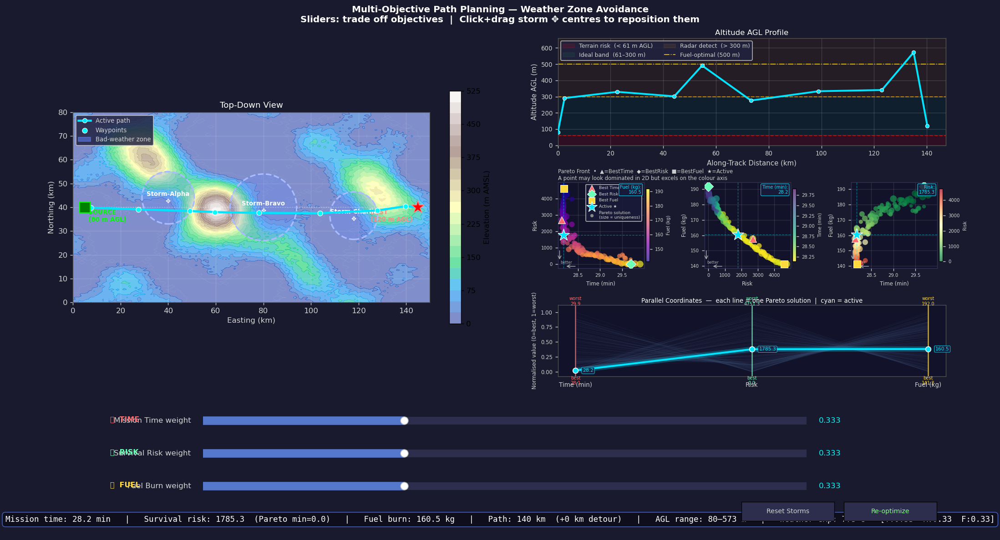
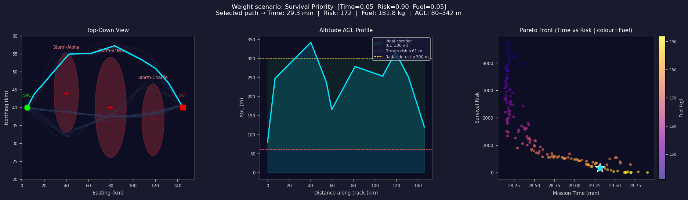
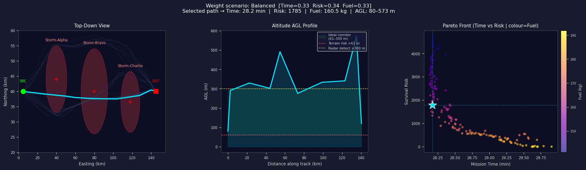
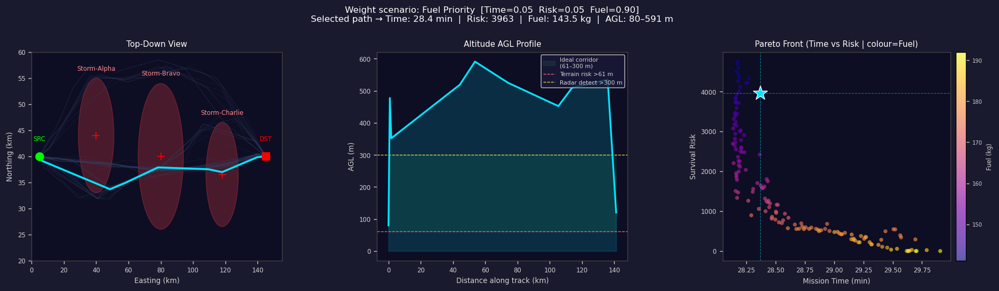

# Visualization Guide — Multi-Objective Path Planning

This document explains every panel and control in the interactive visualization
(`viz_sliders.py` for desktop, `app.py` for the web version).

---

## Full Dashboard Overview



The dashboard is divided into four zones:

```
┌──────────────────────┬──────────────────────────────────────────┐
│                      │  Altitude AGL Profile         (top-right) │
│  Top-Down Map        ├──────────────────────────────────────────┤
│  (left, large)       │  Pareto Front Scatter Plots  (mid-right)  │
│                      ├──────────────────────────────────────────┤
│                      │  Parallel Coordinates        (bot-right)  │
├──────────────────────┴──────────────────────────────────────────┤
│  Weight Sliders                                       (bottom)   │
├─────────────────────────────────────────────────────────────────┤
│  Telemetry Bar                                   (very bottom)   │
└─────────────────────────────────────────────────────────────────┘
```

---

## 1. Top-Down View (Left Panel)

The bird's-eye map of the 150 × 80 km airspace.



### What you see

| Element | Meaning |
|---------|---------|
| **Green circle (SRC)** | Take-off point — aircraft starts here |
| **Red square (DST)** | Destination — landing zone |
| **Bright cyan line** | The currently selected optimal path |
| **Cyan squares on path** | The 8 intermediate 3D waypoints placed by the optimizer |
| **Red/dark ellipses** | The three storm keep-out zones: Storm-Alpha (north), Storm-Bravo (centre, directly on route), Storm-Charlie (south-east) |
| **Background heatmap** | Terrain elevation — bright yellow = high ground, dark blue = valleys and low terrain |
| **Faint blue lines** | All 150 Pareto-optimal paths found by NSGA-II — shows the full solution space the optimizer explored |

### How the path changes with sliders

- **Risk slider → high**: the path curves significantly north and south to stay far away
  from all three storm circles, accepting a longer route
- **Fuel slider → high**: the path cuts nearly straight through the storms — going direct
  costs less fuel even though it means weather exposure
- **Time slider → high**: the path takes the most direct route, minimising distance

> In the **desktop version** (`viz_sliders.py`) you can **click and drag** a storm circle
> to reposition it. The path re-evaluates immediately for the new storm layout.
> Click **Reset Storms** to restore the original positions.

---

## 2. Altitude AGL Profile (Top-Right Panel)

Shows how high the aircraft flies above the ground at every point along the route.

### What you see

| Element | Meaning |
|---------|---------|
| **X-axis** | Distance flown along the track (km) from take-off to landing |
| **Y-axis** | Altitude Above Ground Level (AGL) in metres |
| **Red dashed line — 61 m** | Terrain collision floor: below this the aircraft risks hitting the ground. Contributes to survival risk (f₂). |
| **Yellow dashed line — 300 m** | Radar detection threshold: above this the aircraft is visible to enemy radar. Also contributes to f₂. |
| **Green shaded band (61–300 m)** | The **ideal stealth corridor** — high enough to clear terrain, low enough to avoid radar |
| **Cyan filled line** | The selected path's actual altitude profile |

### Reading the altitude profile across scenarios

**Survival priority** (Risk=0.9):

The path hugs the green band tightly — staying above 61 m to avoid terrain collision
and below 300 m to avoid radar detection. The aircraft does not climb above the yellow
line at any point.

**Fuel priority** (Fuel=0.9):

The path climbs to 500–600 m AGL — well above the radar detection line. Thinner air at
high altitude reduces aerodynamic drag, which directly lowers fuel burn. The aircraft
accepts the radar detection risk in exchange for efficiency.

---

## 3. Pareto Front Scatter Plots (Middle-Right — Three Panels)

Since there are three objectives that conflict with each other, no single 2D plot can
show everything. Three side-by-side scatter plots each show a different **pair** of
objectives, with the third encoded as colour.


### The Pareto Front concept

The optimizer runs NSGA-II and returns 150 **Pareto-optimal** solutions — a set of paths
where you cannot improve one metric without making at least one other metric worse.
These 150 solutions form the **Pareto front**: the boundary of what is physically
achievable under the constraints.

There is no single "best" solution. The Pareto front gives a decision-maker the full
picture of available trade-offs, then the sliders let the user pick their preferred
point on that front.

### The three panels

| Panel | X-axis | Y-axis | Colour |
|-------|--------|--------|--------|
| **Left** | Mission Time (min) | Survival Risk | Fuel burn (kg) |
| **Middle** | Survival Risk | Fuel burn (kg) | Mission Time (min) |
| **Right** | Mission Time (min) | Fuel burn (kg) | Survival Risk |

### Markers on each panel

| Marker | Meaning |
|--------|---------|
| **▲ Red triangle** | The single solution with the best (lowest) mission time |
| **◆ Green diamond** | The single solution with the best (lowest) survival risk |
| **■ Yellow square** | The single solution with the best (lowest) fuel burn |
| **★ Cyan star** | The currently active solution, selected by the slider weights |
| **Cyan dashed crosshairs** | Lock to the ★ star and show its exact position on both axes |
| **Callout box (top-right corner)** | Shows the active solution's value on the **hidden third objective** |
| **Point size** | Crowding distance — larger points are more isolated on the Pareto front, representing more unique trade-off positions |

### Why a point can look "dominated" in one panel but still be Pareto-optimal

In any single 2D panel, a point may appear to have another point that is lower-left
(better on both visible axes). This is **not** a contradiction. That other point is worse
on the third objective (shown as colour). The callout box always shows the active
solution's value on that hidden axis — this is why it was chosen despite looking
suboptimal in the 2D projection.

> All 150 shown solutions are equally Pareto-optimal. None dominates another
> across all three objectives simultaneously.

---

## 4. Parallel Coordinates Plot (Bottom-Right Panel)

Parallel coordinates show **all three objectives on a single plot** simultaneously.
Unlike the scatter plots (which only show pairs), this view shows the complete
three-dimensional structure of every solution at once.

### How to read it

Each vertical axis represents one objective:

```
Time (min)        Risk          Fuel (kg)
    │                │               │
   0.0 (best)       0.0 (best)      0.0 (best)
    │                │               │
    │                │               │
   1.0 (worst)      1.0 (worst)     1.0 (worst)
```

Values are **normalised** to [0, 1] per objective, so all three axes are directly
comparable. The actual values are shown in callout labels at each axis crossing.

| Element | Meaning |
|---------|---------|
| **Faint gray lines** | All 150 Pareto-optimal solutions — each one traces its normalised score across all three axes |
| **Bright cyan line with glow** | The currently active solution — stands out clearly against the background |
| **Callout numbers on each axis** | Actual values (minutes / risk score / kg) at the active solution's crossing point |
| **Coloured vertical axis lines** | Red = Time, Green = Risk, Yellow = Fuel |

### What crossing lines reveal

Where lines **cross** between two axes = trade-off. For example, if many lines cross
between Risk and Fuel (some going from low-Risk to high-Fuel, others high-Risk to
low-Fuel), that tells you reducing risk requires burning more fuel — the two objectives
genuinely conflict for this problem.

A perfectly balanced solution would cross all three axes at the same normalised height
(e.g. 0.5, 0.5, 0.5). A solution skewed toward risk avoidance would cross Risk near 0.0
but cross Fuel and Time near higher values.

---

## 5. Weight Sliders (Bottom Controls)

Three sliders let the user express their **preference** over the three objectives in
real time. As soon as any slider moves, all panels update instantly.

| Slider | Colour | Controls |
|--------|--------|---------|
| **⏱ TIME weight** | Red | How much to penalise long mission time |
| **🛡 RISK weight** | Green | How much to penalise weather exposure and flying outside the stealth corridor |
| **⛽ FUEL weight** | Yellow | How much to penalise fuel consumption |

### How weights work

Only the **ratios** between sliders matter, not the absolute values. Setting
Risk=1.0 and the rest to 0.0 gives the same result as Risk=0.9, others=0.05.
The status bar always shows the normalised weights `[T:xx R:xx F:xx]`.

### What each priority produces

**Survival priority — Risk=0.9, Time=0.05, Fuel=0.05**


- Path curves **north** to avoid Storm-Alpha and Storm-Bravo
- Altitude stays firmly in the **green stealth corridor** (80–342 m AGL)
- Longer route accepted (29.3 min vs optimal 28.1 min)
- Higher fuel burn (181.8 kg) because of the detour
- Risk score: **172** (near the Pareto minimum of 0)

---

**Balanced — Time=0.33, Risk=0.34, Fuel=0.33**



- Moderate north detour — avoids storms partially
- Altitude varies 80–573 m (some time above the radar line)
- Compromise on all three: 28.2 min, risk 1785, 160.5 kg
- The ★ star sits mid-way on the Pareto scatter

---

**Fuel priority — Time=0.05, Risk=0.05, Fuel=0.90**



- Path cuts **nearly straight** through the storms (no detour)
- Aircraft climbs to **591 m AGL** — well above the radar line — for minimum drag
- Lowest fuel burn: **143.5 kg**
- Highest risk: **3963** (storm exposure + radar detection combined)
- ★ star jumps to the top-left of the scatter (low fuel, high risk)

---

## 6. Telemetry Bar (Very Bottom Strip)

Displays the raw numbers for the active solution at a glance:

```
Mission time: 28.2 min  |  Survival risk: 1785.3  (Pareto min=0.0)
Fuel burn: 160.5 kg  |  Path: 148 km  (+8 km detour)
AGL range: 80–573 m  |  Weather exp: 45 s  [T:0.33  R:0.34  F:0.33]
```

| Field | Meaning |
|-------|---------|
| **Mission time** | Total 3D flight time in minutes |
| **Survival risk** | Computed f₂ value; `Pareto min` shows the best achievable on the current front |
| **Fuel burn** | Total fuel in kg for the selected path |
| **Path** | 2D ground track length; detour = extra km versus flying straight |
| **AGL range** | Minimum and maximum altitude above ground across the whole flight |
| **Weather exp** | Seconds spent inside a storm circle |
| **[T: R: F:]** | Normalised weight vector currently applied |

---

## 7. Interactive Controls — Desktop Version Only

### Dragging Storms

In `viz_sliders.py`, click and hold near any storm centre (+) and drag to reposition it.
The path and all plots update immediately to reflect the new storm layout using the
cached Pareto paths. After dragging, click **Re-optimize** to run a fresh NSGA-II
optimisation shaped around the new storm positions.

### Buttons

| Button | Action |
|--------|--------|
| **Reset Storms** | Restores all three storms to their original positions |
| **Re-optimize** | Runs NSGA-II (pop=120, gen=100) with current storm positions and replaces the Pareto front |

---

## 8. Summary — What Each Panel Answers

| Question | Panel to look at |
|----------|-----------------|
| Where does the aircraft fly geographically? | Top-Down Map |
| How high does it fly? Is it in the stealth band? | Altitude AGL Profile |
| What are all the available trade-offs? | Pareto Scatter (3 panels) |
| Why is *this* solution chosen and not a nearby one? | Pareto scatter crosshair callout |
| How does the active solution compare across all 3 objectives at once? | Parallel Coordinates |
| What is the numerical performance of the active path? | Telemetry Bar |
